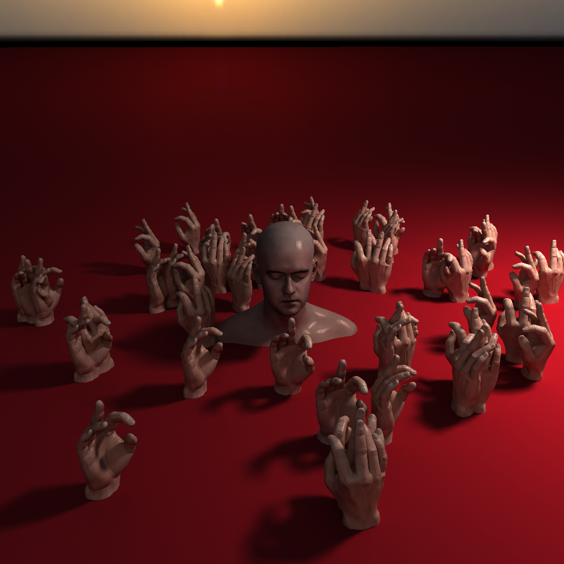
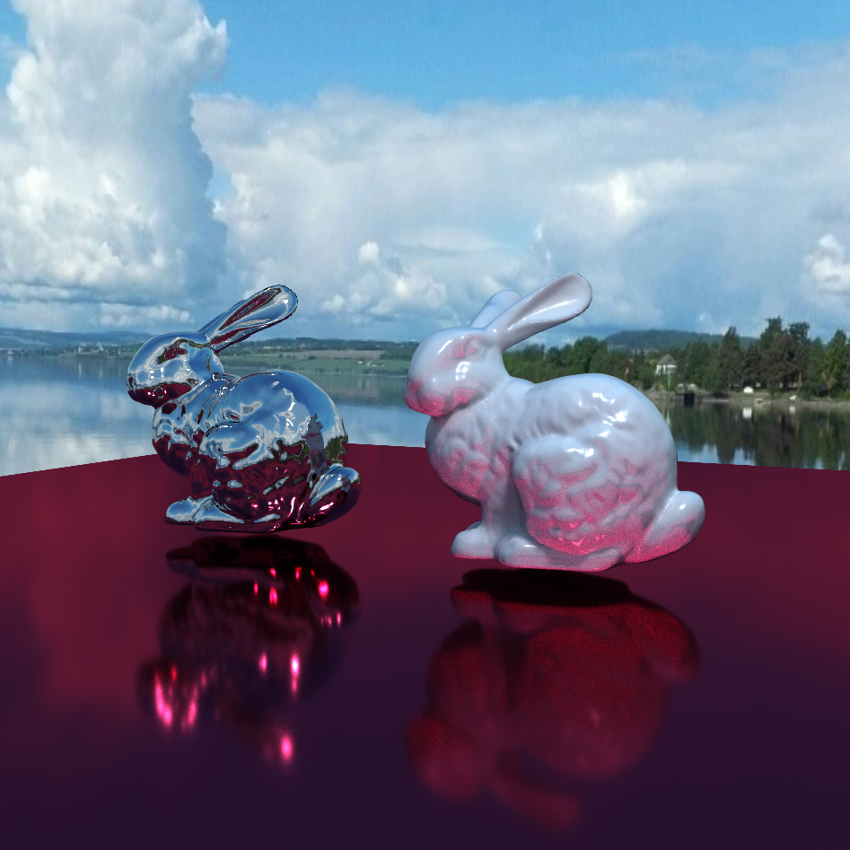
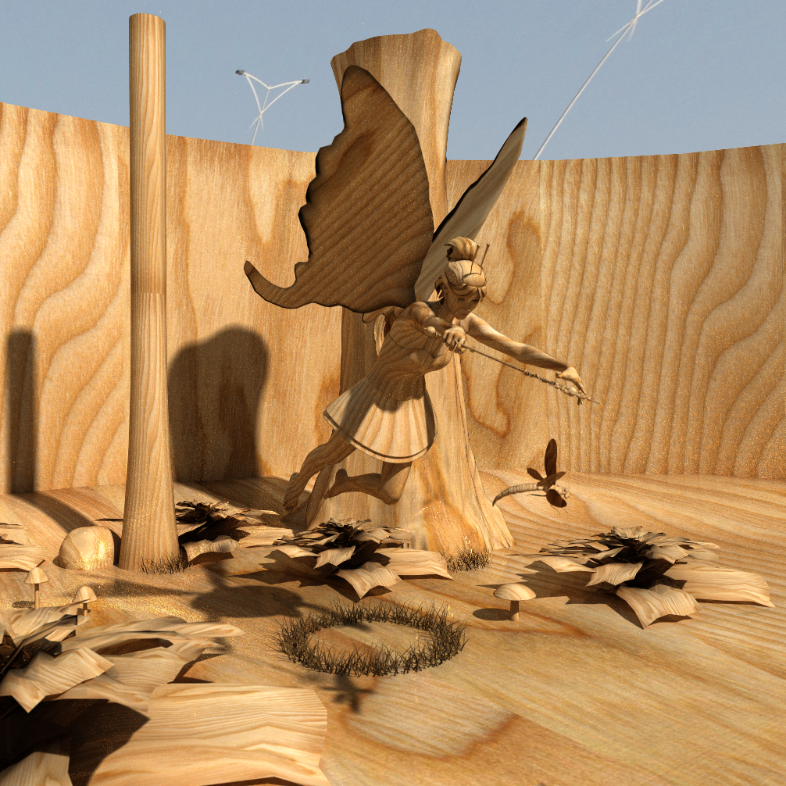
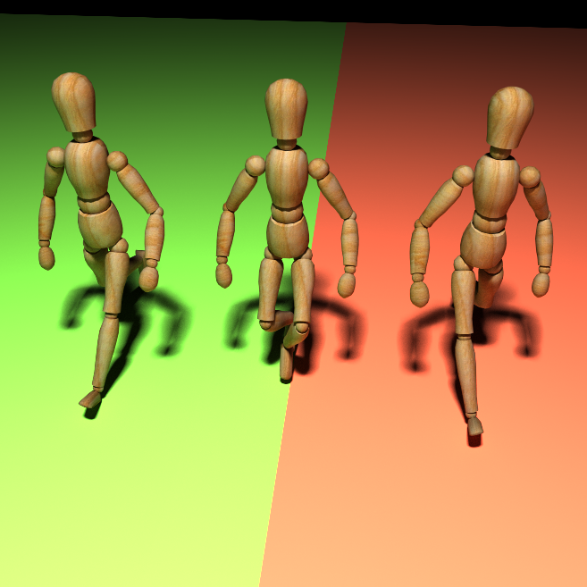
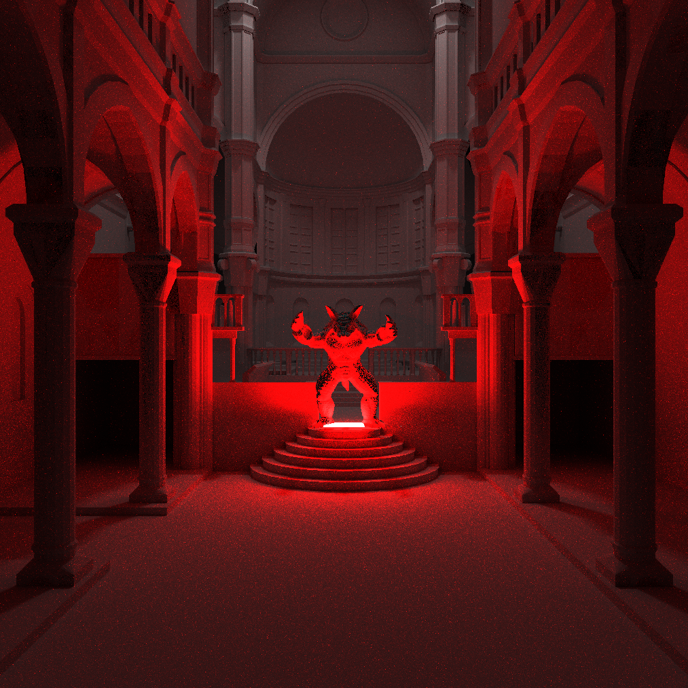

# Fragment Shader Path Tracer

I made this to explore photo-realistic rendering in web browsers. Feel free to fork and open a PR. I'm a graphics hobbyist; I welcome constructive feedback.
 
Requirements:
* An up-to-date desktop browser that supports WebGL 2
* A top-end discrete GPU (for now)

TODOs (Not Exhaustive):
* Fully implement specular and diffuse BRDFs
* Refraction with configurable IoR
* Better BVH construction (SAH) and traversal.

## Demo

WARNING: Any one of these could crash your drivers/system. Run at your own risk. I recommend trying the links in order. If your system remains responsive, maybe try the next one.  I've tested on Windows and Linux with a GTX 1080 and GTX 980 

## Experiments







## Forking

Run an HTTP server of your choice from the root directory.

`python -m http.server`

Depending on the port used, open a url like: http://localhost:8000/?scene=bunnies&res=800

`scene` is the base filename of the scene json file you wish to render.
`res` is the height and width of the canvas in pixels and defaults to window height if absent.

Try messing with the mouse, scrolling, and WASD keys.

A scene config file like `bunnies.json` looks like:

```
{
  "environment": "texture/pano.jpg",
  "atlasRes": 2048,
  "props": [
    {
      "path": "mesh/bunny_big.obj",
      "scale": 0.2,
      "rotate": [{"angle": 0, "axis": [0,0,1]}],
      "translate": [0.4,-0.2,0],
      "reflectance": [0.9,0.9,0.9],
      "emittance": [0,0,0],
      "specular": 0.05,
      "normals": "smooth"
    },
    {
      "path": "mesh/bunny_big.obj",
      "scale": 0.2,
      "rotate": [{"angle": 0, "axis": [0,0,1]}],
      "translate": [-0.4,-0.2,0],
      "reflectance": [0.9, 0.9, 0.9],
      "emittance": [0,0,0],
      "specular": 0.001,
      "normals": "smooth",
      "metal": true
    },
    {
      "path": "mesh/top.obj",
      "scale": 0.4,
      "rotate": [{"angle": 0, "axis": [0,0,1]}],
      "translate": [1,2,1],
      "reflectance": [0,0,0],
      "emittance": [100,100,100],
      "specular": 0.9
    },
    {
      "path": "mesh/top.obj",
      "scale": 4,
      "rotate": [{"angle": 3.1415, "axis": [0,0,1]}],
      "translate": [0,-0.3,0],
      "reflectance": [0.9,0.2,0.4],
      "emittance": [0,0,0],
      "specular": 0.01,
      "metal": true
    }
  ]
}
```

