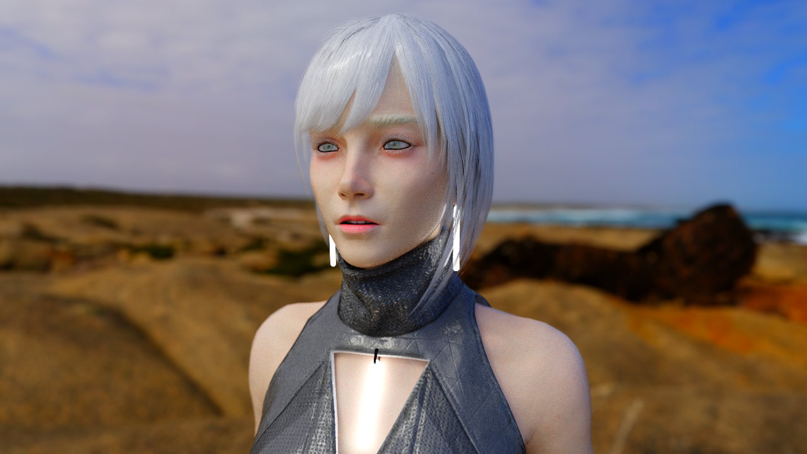
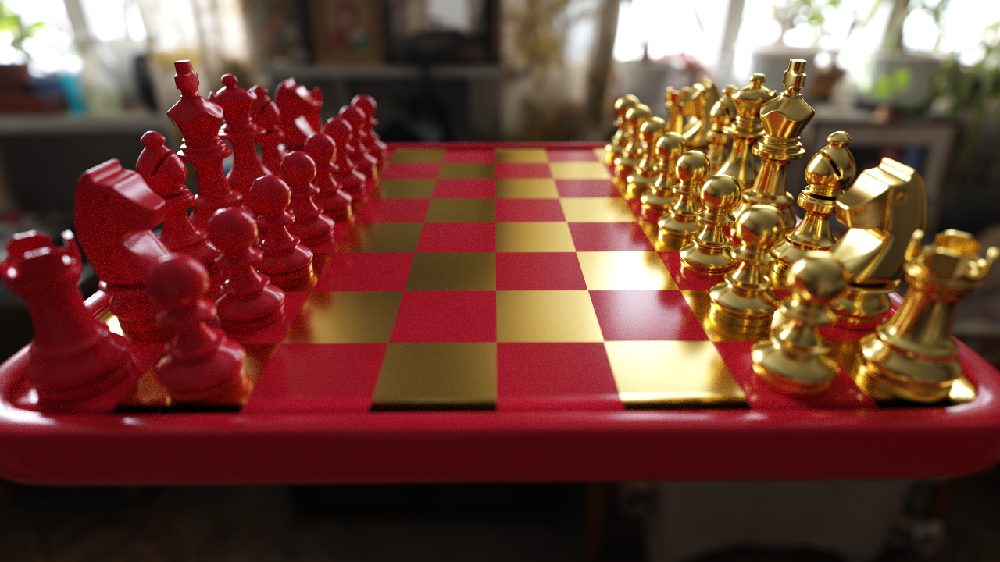
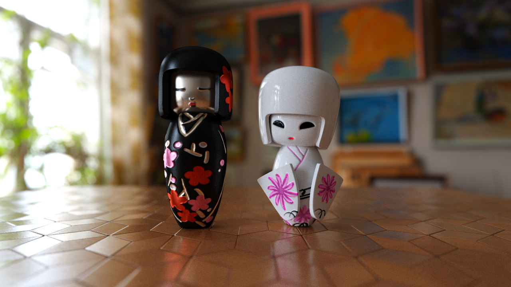
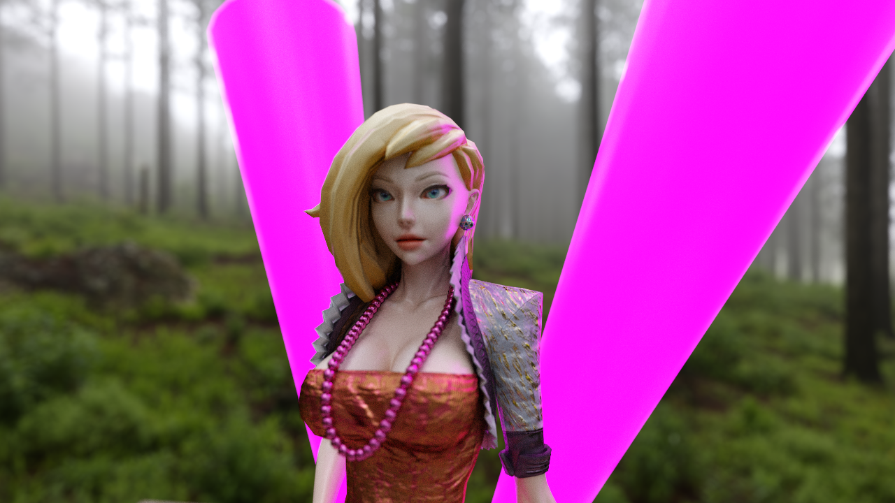
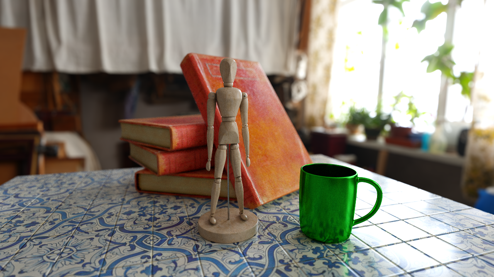

# Fragment Shader Path Tracer

I made this to explore photo-realistic rendering in web browsers. Feel free to fork and open a PR. I'm a graphics hobbyist; I welcome constructive feedback.
 
Requirements:
* An up-to-date desktop browser that supports WebGL 2 AND ES6 module export + import
* A top-end discrete GPU (for now)

Features:
* Alpha textures / transparency
* Refraction
* Bokeh depth of field with variable aperture size
* Varible focus depth and auto-focus
* PBR material maps. Metallicness, roughness, emissivity. 
* Post processing: exposure, saturation

TODOs (Not Exhaustive):
* Fix light sampling
* HDRi importance sampling
* Parallelize BVH construction and texture packing with web workers
* Verify Microfacet BxDF correctness
* Faster BVH construction and traversal.
* Make metallic and roughness more flexible
* Better support for asset standards. OBJ, MTL, etc...
* Tiled rendering

## Demo

**WARNING**: Any one of these links could crash your drivers/system. Run at your own risk. I recommend trying the links in order. If your system remains responsive, maybe try the next one.  
I've tested with FF and Chrome on Windows and Linux with a GTX 1080 and GTX 980

**Light sampling is currently broken**

[Bunny](http://apbodnar.github.io/FSPT/index.html?scene=bunny&res=400)

[Dolls](http://apbodnar.github.io/FSPT/index.html?scene=wood&res=400)

[Bunnies?](http://apbodnar.github.io/FSPT/index.html?scene=bunnies&res=400)


## Experiments









## Forking

Run an HTTP server of your choice from the root directory.

**Warning** For some reason using javascript modules (`type="module"`) breaks python's SimpleHttpServer.
I recommend using Node's `http-server`

Depending on the port used, open a url like: http://localhost:8000/?scene=bunnies&res=800

`scene` is the base filename of the scene json file you wish to render.

`res` is the height and width of the canvas in pixels and defaults to the window dimensions if unused. Valid paterns are `res=<width>x<height>`, and `res=<square dimensions>` for a square viewport, `res=<scalar>x` to scale the internal resolution by 1 / <scalar>.

`mode` set the desired features.  For alpha use `mode=alpha`. For light sampling `mode=nee`. For both use `mode=alpha_nee`.  Light sampling slows down rendering but can vastly speed up convergence if using area lights.

Try messing with the mouse, scrolling, and WASD + RF keys.

A scene config file like `bunnies.json` looks like:

```
{
  "samples": 2000,
  "environment": "texture/woodsr.jpg",
  "static_props": [
    {
      "path": "mesh/top.obj",
      "scale": 1,
      "rotate": [{"angle": 0.5, "axis": [1,0,0]}],
      "translate": [0,4.75,5.4],
      "diffuse": [1,1,1],
      "emittance": [80,80,80],
      "roughness": 0.1,
      "normals": "flat"
    },
    {
      "path": "mesh/top.obj",
      "scale": 6,
      "rotate": [{"angle": 3.1415, "axis": [0,0,1]}],
      "translate": [0,-0.2,0],
      "emittance": [0,0,0],
      "roughness": 0.1,
      "normals": "flat",
      "diffuse": "asset_packs/dungeon/ground1Color.png",
      "normal": "asset_packs/dungeon/ground1Normal.png"
    },
	{
	  "path": "mesh/top.obj",
      "scale": 6,
      "rotate": [{"angle": -1.57, "axis": [1,0,0]}],
      "translate": [0,2.8,-3],
      "diffuse": [0.1,1,0.5],
      "emittance": [0,0,0],
      "ior": 2,
	  "roughness": "asset_packs/dungeon/ground1Specular.png"
    },
    {
      "path": "asset_packs/dra/dra.obj",
      "scale": 0.004,
      "rotate": [{"angle": 0, "axis": [0,1,0]}],
      "translate": [1,0,0],
      "diffuse": [0.3,0.3,0.3],
      "emittance": [0,0,0],
      "normals": "mesh",
      "roughness": 0.3,
      "ior": 1.5
    }
  ],
  "animated_props": {
    "b1": {
      "path": "asset_packs/morrigan/Morrigan.obj",
      "scale": 0.014,
      "rotate": [{"angle": 0, "axis": [0,1,0]}],
      "translate": [-1,-0.21,0],
      "emittance": [0,0,0],
      "roughness": 0.3,
      "normals": "mesh",
      "ior": 1.3
    }
  }
}
```
