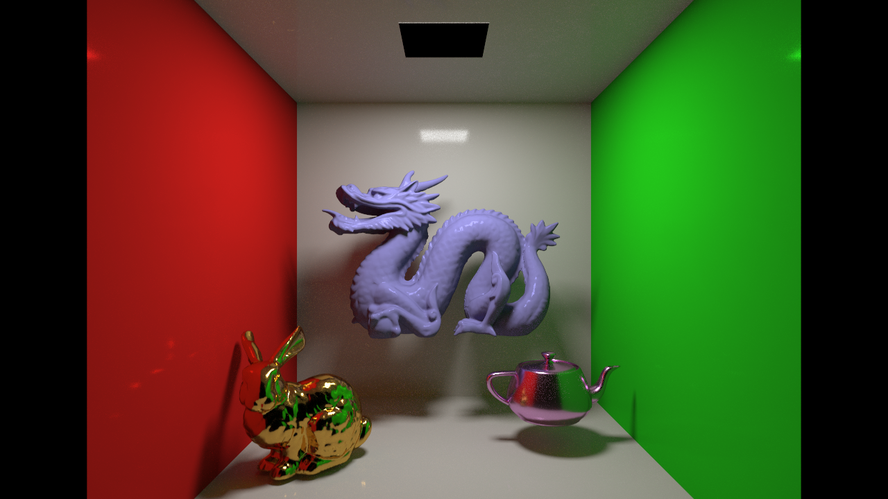
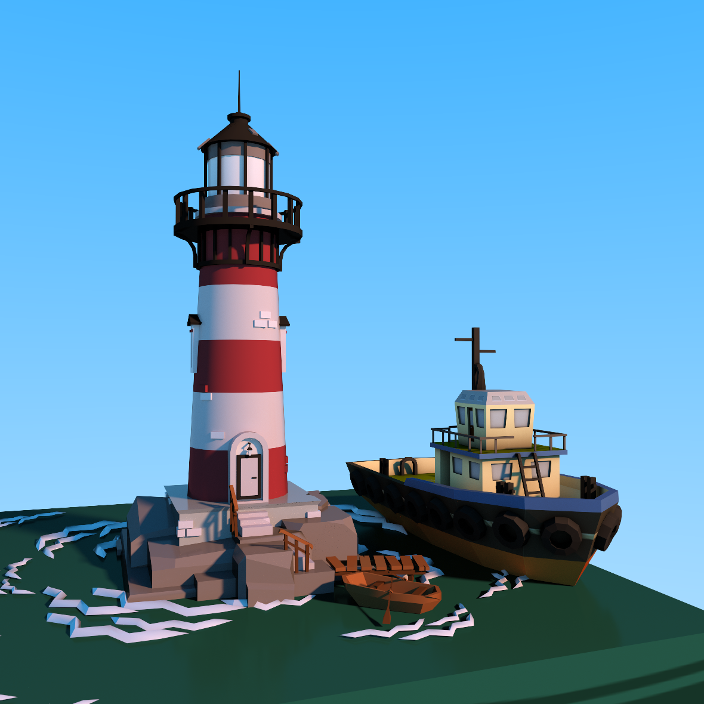
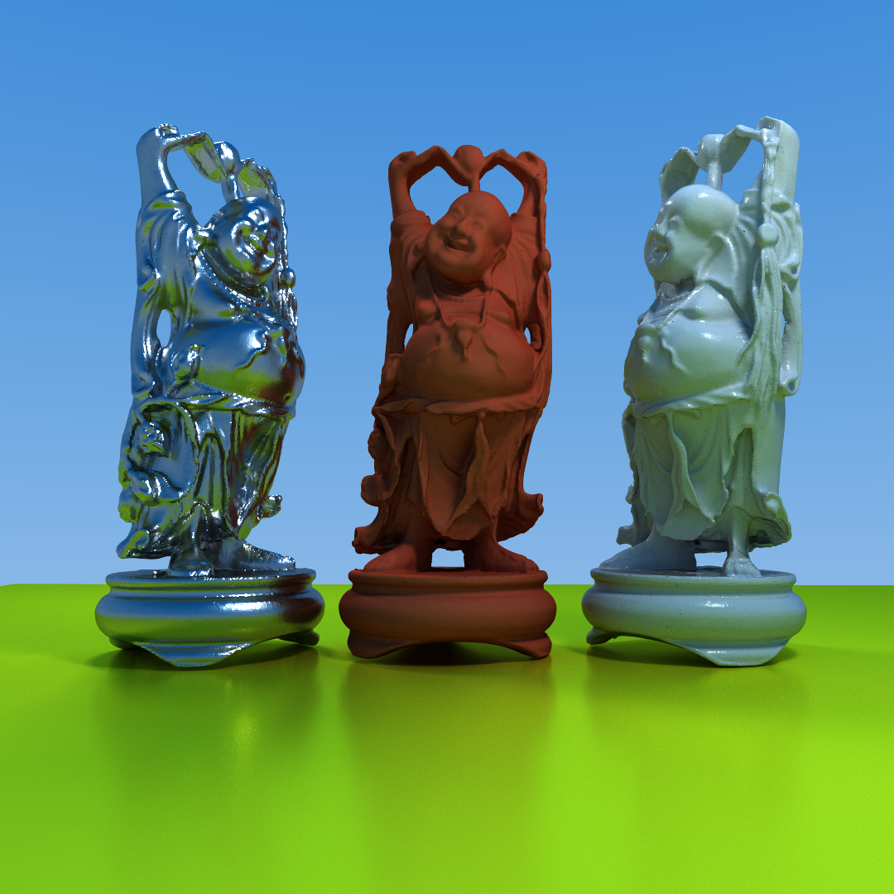

# Fragment Shader Path Tracer

I made this to explore photo-realistic rendering in web browsers. Feel free to fork and open a PR. I'm a graphics hobbyist; I welcome constructive feedback.
 
Requirements:
* An up-to-date desktop browser that supports WebGL 2 AND ES6 module export + import
* A top-end discrete GPU (for now)

TODOs (Not Exhaustive):
* Fully implement microfacet BRDF
* Configurable IoR
* Better BVH construction (SAH) and traversal.
* Rewrite scene file structure.
* Actually support asset standards. OBJ, MTL, etc...
* Tiled rendering
* Make faster

## Demo

**WARNING**: Any one of these links could crash your drivers/system. Run at your own risk. I recommend trying the links in order. If your system remains responsive, maybe try the next one.  
I've tested with FF and Chrome on Windows and Linux with a GTX 1080 and GTX 980

[Bunny](http://apbodnar.github.io/FSPT/index.html?scene=bunny&res=400)

[Dolls](http://apbodnar.github.io/FSPT/index.html?scene=wood&res=400)

[Bunnies?](http://apbodnar.github.io/FSPT/index.html?scene=bunnies&res=400)


## Experiments









"Lighthouse.obj" and "Tugboat.obj" by 'Poly by Google' is licensed under CC BY 2.0
"2B" by Kimchi_Lord is licensed under CC Attribution-NonCommercial-NoDerivs

## Forking

Run an HTTP server of your choice from the root directory.

`python -m http.server`

Depending on the port used, open a url like: http://localhost:8000/?scene=bunnies&res=800

`scene` is the base filename of the scene json file you wish to render.
`res` is the height and width of the canvas in pixels and defaults to window height if absent.

Try messing with the mouse, scrolling, and WASD keys.

A scene config file like `bunnies.json` looks like:

```
{
  "environment": "texture/field.jpg",
  "atlasRes": 2048,
  "samples": 1000,
  "static_props": [
    {
      "path": "mesh/plank.obj",
      "scale":2,
      "rotate": [{"angle": 3.1415, "axis": [0,0,1]}],
      "translate": [1,-0.3,0],
      "reflectance": [1,0.4,0.4],
      "emittance": [0,0,0],
      "roughness": 0.1
    },
    {
      "path": "mesh/plank.obj",
      "scale": 2,
      "rotate": [{"angle": 3.1415, "axis": [0,0,1]}],
      "translate": [-1,-0.3,0],
      "reflectance": [0.9,0.9,0.9],
      "emittance": [0,0,0],
      "roughness": 0.15,
      "metal": true
    },
    {
      "path": "mesh/dragon.obj",
      "scale": 0.11,
      "rotate": [{"angle": 0, "axis": [0,1,0]}],
      "translate": [0,-0.2,-0.5],
      "reflectance": [1,1,1],
      "emittance": [0,0,0],
      "roughness": 0.2,
      "normals": "smooth",
      "dielectric": true
    }
  ],
  "animated_props": {
    "p1": {
      "path": "mesh/bunny_big.obj",
      "scale": 0.18,
      "rotate": [{"angle": 0, "axis": [0,1,0]}],
      "translate": [0.05,-0.2,0],
      "reflectance": [1,1,1],
      "emittance": [0,0,0],
      "roughness": 0.01,
      "normals": "smooth"
    },
    "p2": {
      "path": "mesh/bunny_big.obj",
      "scale": 0.18,
      "rotate": [{"angle": 0, "axis": [0,1,0]}],
      "translate": [-0.5,-0.2,0],
      "reflectance":  [1,0.766,0.336],
      "emittance": [0,0,0],
      "roughness": 0.15,
      "normals": "smooth",
      "metal": true
    },
    "p3": {
      "path": "mesh/bunny_big.obj",
      "scale": 0.18,
      "rotate": [{"angle": 0, "axis": [0,1,0]}],
      "translate": [0.6,-0.2,0],
      "reflectance":  [0.5,1,0.5],
      "emittance": [0,0,0],
      "roughness": 0.3,
      "normals": "smooth",
      "diffuse": true
    },
    "l1": {
      "path": "mesh/top.obj",
      "scale": 0.5,
      "rotate": [{"angle": 0, "axis": [0,1,0]}],
      "translate": [1,2,1],
      "reflectance": [0, 0, 0],
      "emittance": [40, 40, 40],
      "roughness": 0.95
    }
  }
}
```
`animated_props` will be interpreted as static props unless the server is https://github.com/apbodnar/FSPT-server

Any prop with a non zero emittance will be treated as a light source. Any prop without a `texture` will use its reflectance as a solid color. More rotations can be applied by adding more into the array.
