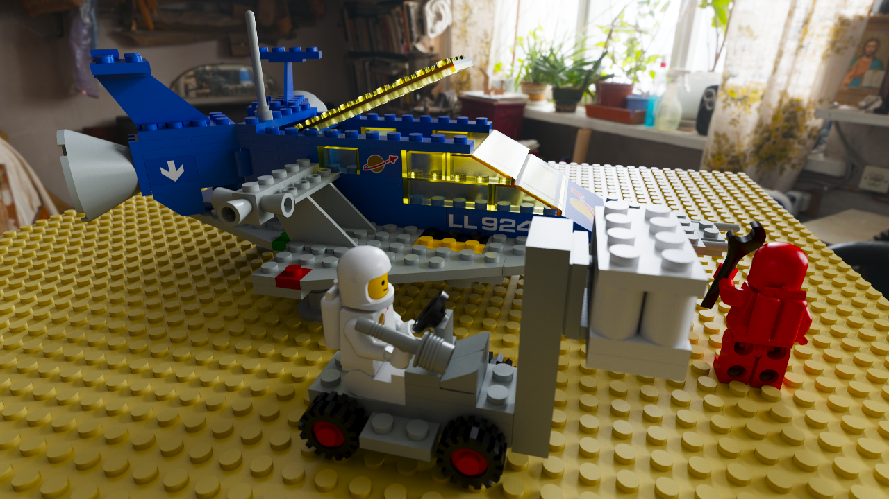
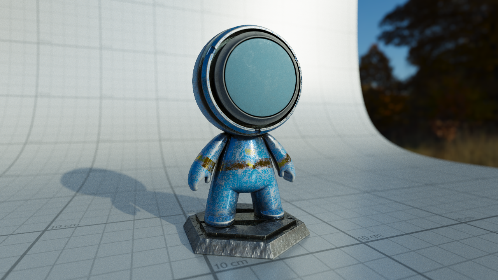
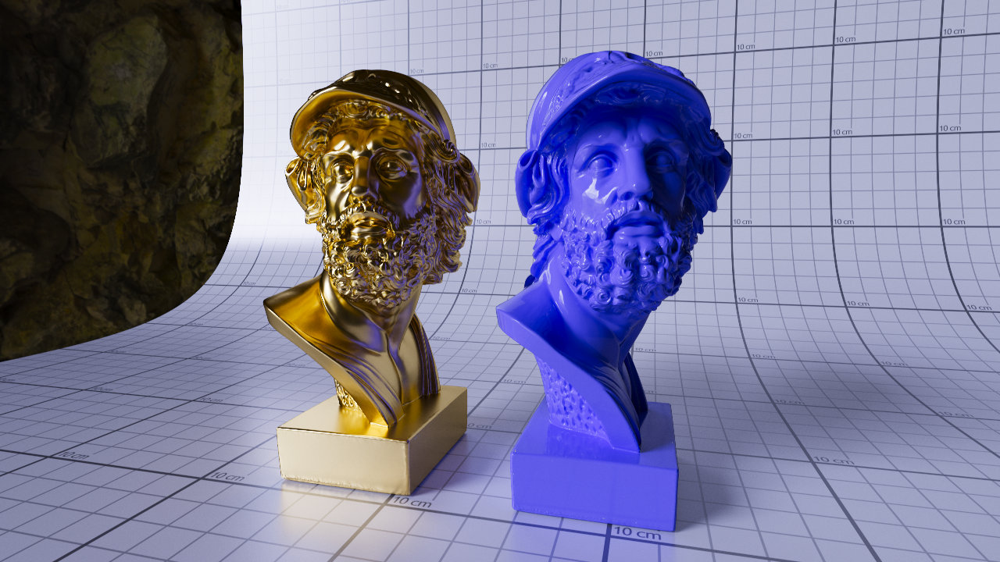

# Fragment Shader Path Tracer

I made this to explore photo-realistic rendering in web browsers. 
 
Requirements:
* An up-to-date desktop browser that supports WebGL 2 AND ES6 module export + import
* A top-end discrete GPU (for now)

Features:
* UE4 microfacet BRDF
* Image based lighting
* Area lights with light sampling (currently incorrect)
* Bokeh depth of field with variable aperture size
* Varible focus depth and auto-focus
* Normal maps
* PBR material maps. Metallicness, roughness, emissivity.
* Refraction, Beer's law
* Post processing: exposure, saturation, denoising
* HDRi importance sampling
* "Camera shaders"

TODOs (Not Exhaustive):
* Switch to a low discrepancy generator
* Refactor texture packing to be far, far less wasteful of memory (current worst case could use megabytes where bytes are needed)
* Fix area light sampling | Explore solid angle sampling of volume lights
* Parallelize BVH construction and texture packing with web workers
* Faster BVH construction and traversal.
* Tiled rendering
* Port to WebGPU compute shaders once widely available

## Demo

**Light sampling is currently broken**

Try messing with the mouse, scrolling, and WASD + RF keys.  Be sure to adjust the exposure and saturation.

[Bunny](http://apbodnar.github.io/FSPT/index.html?scene=bunny&mode=ne&res=1280x720)

## Experiments









## Forking

Run an HTTP server of your choice from the root directory.

**Warning** For some reason using javascript modules (`type="module"`) breaks python's SimpleHttpServer.
I recommend using Node's `http-server`

Depending on the port used, open a url like: http://localhost:8000/?scene=bunny&res=800

`scene` is the base filename of the scene json file you wish to render.  
`res` is the height and width of the canvas in pixels and defaults to the window dimensions if unused. Valid paterns are `res=<width>x<height>`, and `res=<square dimensions>` for a square viewport, `res=<scalar>x` to scale the internal resolution by 1 / `<scalar>`.

A scene config file like `bunny.json` looks like:

```json
{
  "environment": "environment/autumn_meadow_2k.RGBE.PNG",
  "environmentTheta": 0.66,
  "cameraPos": [-0.751,0.665,1.820],
  "cameraDir": [0.304,-0.489,-0.818],
  "props": [
    {
      "path": "asset_packs/misc/bunny_big.obj",
      "scale": 0.25,
      "rotate": [{"angle": 0, "axis": [0,0,1]}],
      "translate": [0.1,-0.7,0],
      "diffuse": [1,1,1],
      "emittance": [0,0,0],
      "metallicRoughness": [0, 0.5, 0],
      "ior": 1.4,
      "normals": "smooth"
    },
    {
      "path": "asset_packs/misc/top_mono.obj",
      "scale": 4,
      "rotate": [{"angle": 3.1415, "axis": [0,0,1]}],
      "translate": [0,-0.75,0],      
      "emittance": [0,0,0],
      "diffuse": "asset_packs/dungeon/RootNode_baseColor.png",
      "metallicRoughness": "asset_packs/dungeon/RootNode_metallicRoughness.png",
      "normal": "asset_packs/dungeon/RootNode_normal.png",
      "normals": "flat"
    },
    {
      "path": "asset_packs/misc/top_mono.obj",
      "scale": 4,
      "rotate": [{"angle": -1.57, "axis": [1,0,0]}],
      "translate": [0,0.25,-1],
      "emittance": [0,0,0],
      "emission": "asset_packs/dungeon/Scene_-_Root_emissive.jpeg",
      "diffuse": "asset_packs/dungeon/Scene_-_Root_baseColor.jpeg",
      "metallicRoughness": "asset_packs/dungeon/Scene_-_Root_metallicRoughness.png",
      "normal": "asset_packs/dungeon/Scene_-_Root_normal.png",
      "normals": "flat",
	    "ior": "10"
    }
  ]
}
```
`environment` is the epath to the HDRi environment map  
`environmentTheta` is the angle by which the environment is rotated about the y-axis  
`samples` is number of samples per pixels  
`atlasRes` is the resolution of the texture array used for all textures and materials in the scene

## Credits/Thanks

Special thanks to github user [knightcrawler25](https://github.com/knightcrawler25/GLSL-PathTracer)'s excellent GLSL path tracer which was a useful reference for the UE4 BRDF and PDF

Thanks to github user [enkimute](https://github.com/enkimute/hdrpng.js) For hdrpng.js, an extremely useful HDRi conversion tool.

[Mud Material](https://sketchfab.com/3d-models/mud-material-8f6c45d163b24b02a845dd47561a6efe) by SketchFab user Angelo under CC Attribution liscense.

[Stylized Blue Lava Material ( Free )](https://sketchfab.com/3d-models/stylized-blue-lava-material-free-1503b4a9a03540789ca26907af3a07c8) by SketchFab user Plexus Design Türkiye under CC Attribution liscense.
